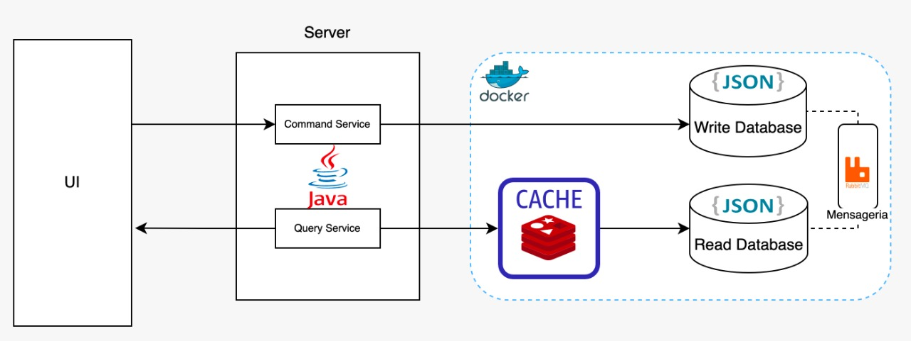
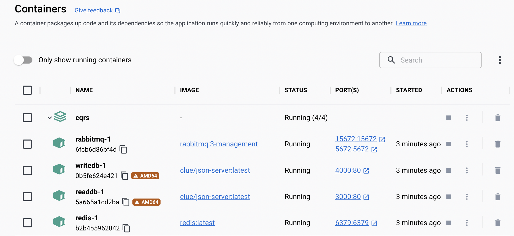
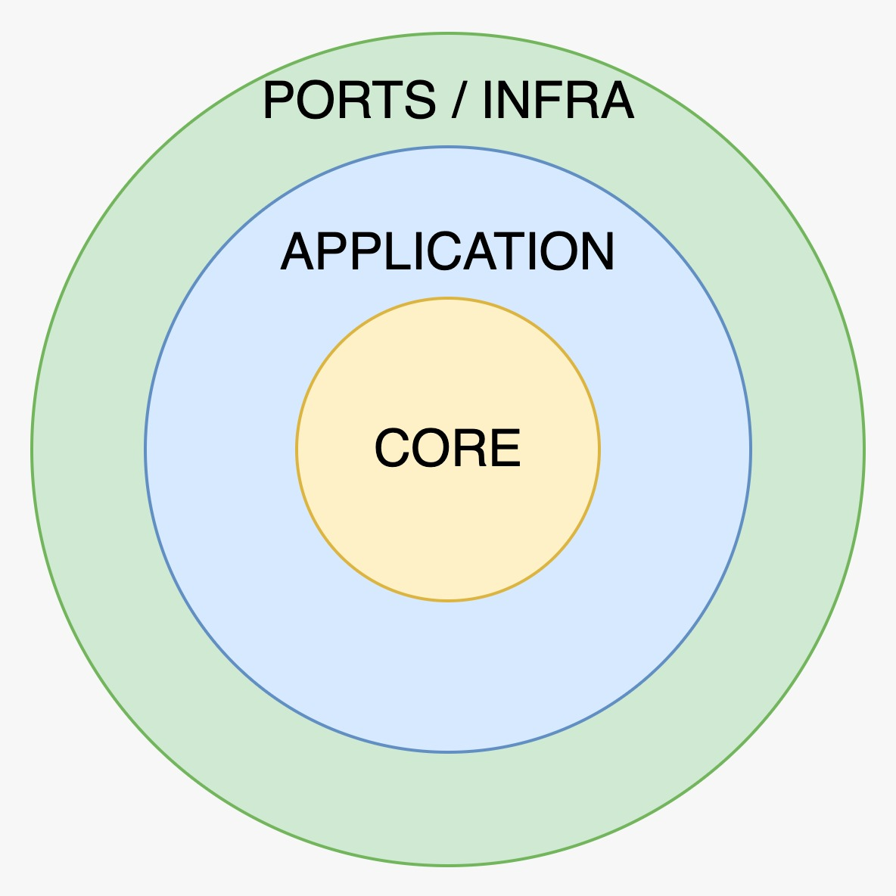

# Documentação técnica:

### Arquitetura física da aplicação:

Infra como código utilizando Docker Compose:
- Todos os componentes externos da aplicação rodam em containers através do Docker Compose
    

### Arquitetura lógica na visualização Onion:

Todo o CORE da aplicação foi escrito com TDD, os próprios testes servem como documentação da aplicação e como roteiro para teste manual.

A camada de Ports (Web) irá invocar a camada de Application, que irá tratar os dados recebidos e passar para o CORE.

E a camada de Infra (RabbitMQ, Redis, Memcached, WriteDatabase, ReadDatabase) devem seguir um contrato de Interface do CORE, utilizando a Inversão de Dependencia do SOLID.

Dessa forma o CORE (Domain e Use Case) fica protegido, pois os dispositivos de I/O externos dependem do CORE, mas o CORE não depende de nenhum componente externo, é um núcleo completamente isolado.

Arquitetura lógica da aplicação desenvolvida utilizando pattern Ports and Adapters:

Implementação do pattern CQRS utilizando Java no backend, mensageria com RabbitMQ, serviço de cache com Redis e Databases com json-server.

Primeiramente foi implementado serviço de cache com Memcached, e depois, foi implementado serviço de cache com Redis.

Design Patterns utilizados:
- Builder
- Singleton

Programação reativa não bloqueante utilizada para enviar a mensagem para a fila.

# Documentação funcional

Para salvar o veiculo:

- Http Method: ``POST``
- endpoint: ``localhost:8080/command``
- Body JSON:

        {
            "marca":"Mercury",  
            "modelo":"Mystique GS 2.5 V6 Mec.",
            "ano":"1995",
            "renavam":"34176773066",
            "placa":"KKH-4170",
            "cor":"Verde"
        }

Nesse momento a aplicação deve logar:

    LOG: Salvando no banco

**Consistência eventual**: após gravar no banco de dados, o backend irá enviar o payload para uma fila do RabbitMQ:

    LOG: Enviando mensagem para RabbitMQ

E essa fila irá sincronizar os dados de forma assincrona:

    LOG: Mensagem do RabbitMQ recebida
    LOG: processando...
    LOG: Sincronizando bancos de dados

Para buscar o veiculo:

- Http Method: ``GET``
- endpoint: ``localhost:8080/query/{id}``

Nesse momento a aplicação irá buscar a informação no cache Redis:

    LOG: conectado no redis com sucesso
    LOG: Buscando do cache

Caso não encontre, busca no banco de dados e salva no cache:

    LOG: Veiculo não está no cache, buscando no banco...
    LOG: Salvo no cache com sucesso

Dessa forma, a próxima vez que buscar este veiculo, não irá buscar no banco, irá pegar do cache:

    LOG: Buscando do cache

Ambas as requests ``POST`` e ``GET`` retornam:

    {
        "id": "4",
        "marca": "Mercury",
        "modelo": "Mystique GS 2.5 V6 Mec.",
        "ano": "1995",
        "renavam": "34176773066",
        "placa": "KKH-4170",
        "cor": "Verde"
    }

# Inicializar serviços externos:

Subir containers:

    docker-compose up
Obs: executar na pasta que tem o ``docker-compose.yml``

Startar Stopar Memcached (default port = 11211):

    brew services restart memcached
    brew services stop memcached

Verificar se porta está em funcionamento na máquina:
    
    lsof -i tcp:PORT