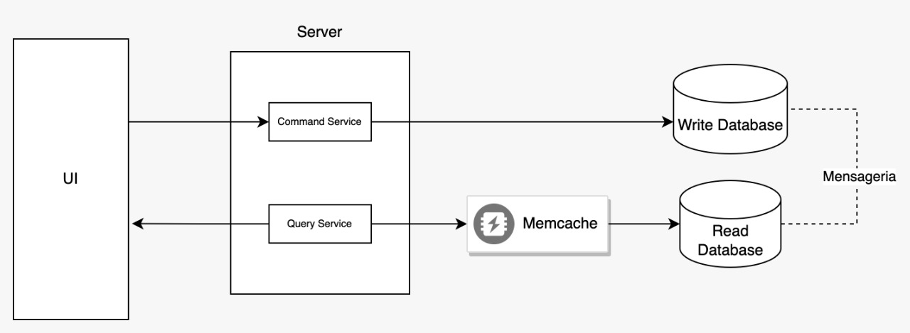
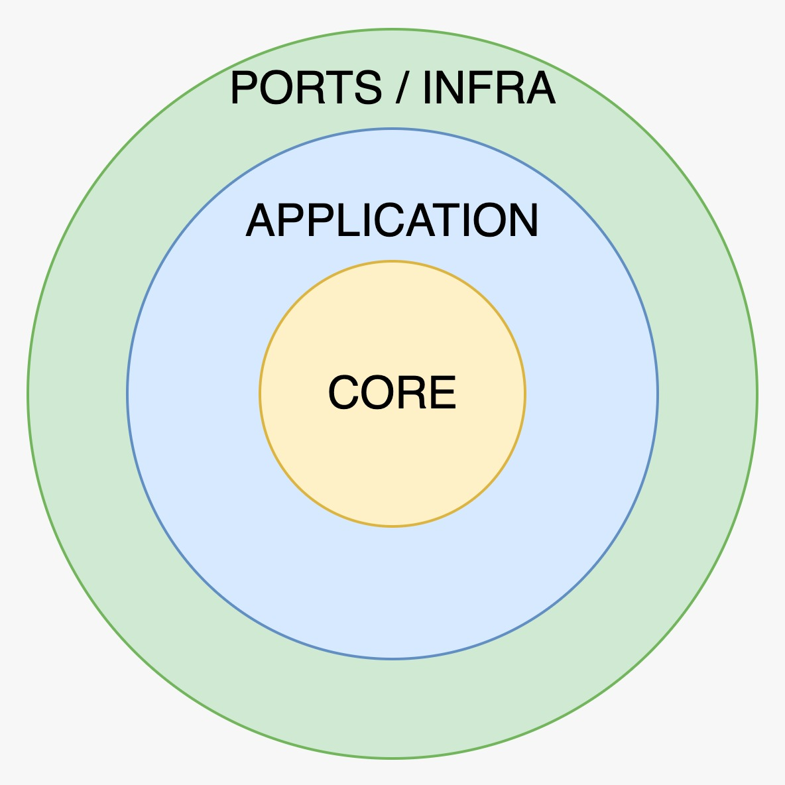

Implementação do pattern CQRS, utilizando mensageria com RabbitMQ e serviço de cache com Memcached.
Arquitetura física da aplicação:

Design Patterns utilizados: 
- Builder
- Singleton

Programação reativa não bloqueante utilizada também, para enviar a mensagem para a fila.

Arquitetura lógica da aplicação desenvolvida utilizando pattern Ports and Adapters:

Arquitetura lógica na visualização Onion:

A camada de Ports (Web) irá invocar a camada de Application, que irá tratar os dados recebidos e passar para o CORE.

E a camada de Infra (WriteDatabase, ReadDatabase, Memcached, RabbitMQ) devem seguir um contrato de Interface do CORE, utilizando a Inversão de Dependencia do SOLID.

Dessa forma o CORE (Domain e Use Case) fica protegido, pois os dispositivos de I/O externos dependem do CORE, mas o CORE não depende de nenhum componente externo, é um núcleo completamente isolado.

Inicializar serviços externos:

Verificar se porta está em funcionamento na máquina:
    
    lsof -i tcp:PORT

Startar Stopar Memcached (default port = 11211):

    brew services restart memcached
    brew services stop memcached

Startar banco de dados de escrita:
    
    json-server --host 192.168.1.4 -p 4000 readdb.json

Startar banco de dados de leitura:

    json-server --host 192.168.1.4 -p 3000 writedb.json

Subir Container RabbitMQ:

    docker run -d  --name rabbitmq -p 15672:15672 rabbitmq:3-management